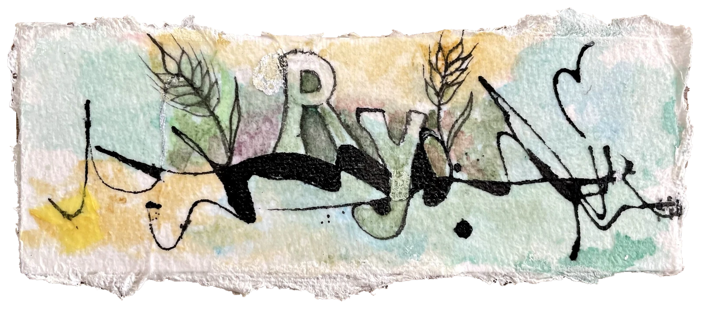

# ry for Zed

[ry](https://github.com/sims1253/ry) is a static checker for R. This extension
connects Zed to the ry language server to report problems in your R code.

See the [editor setup guide](../../docs/usage.md#editors) for installation and configuration.

 
